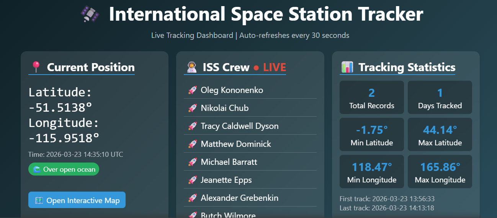
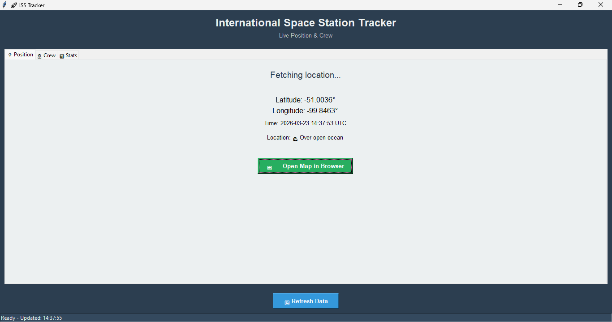
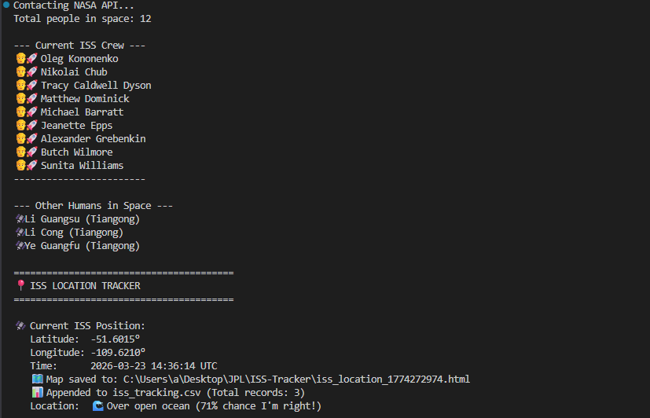

[](https://www.python.org/)
[](LICENSE)
[](https://flask.palletsprojects.com/)

🛰️ ISS Tracker - Complete Python Project Suite

A comprehensive International Space Station tracking application with three interfaces:
- CLI: Terminal-based tracker with maps and CSV logging
- GUI: Desktop application with Tkinter
- Web: Live dashboard with Flask

A. Features
- Live ISS position tracking
- Real-time crew manifest
- Interactive maps with folium
- CSV data logging with pandas
- Tracking statistics
- Cross-platform support

B. Technologies
- Python
- Requests, Pandas, Folium
- Tkinter (GUI)
- Flask (Web)

C. Install dependencies
```bash
pip install -r requirements.txt 
```

D. 📸 Screenshots

--- Web Dashboard


--- Desktop GUI


--- CLI Version


E. Links

- NASA Open Notify API: http://api.open-notify.org/

- Folium Documentation: https://python-visualization.github.io/folium/

- Flask Documentation: https://flask.palletsprojects.com/